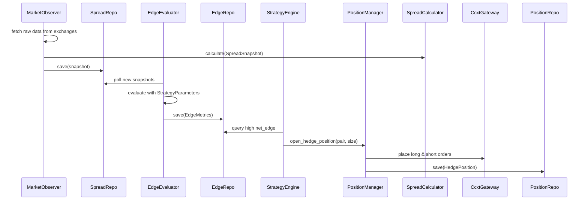

好的。我们以**领域驱动设计（Domain-Driven Design, DDD）** 的视角，重新构建这个跨交易所永续合约对冲套利系统。

我们将：

- 识别 **核心子域（Core Subdomain）**：套利信号生成与执行
- 明确 **通用语言（Ubiquitous Language）**
- 划分 **聚合根（Aggregate Roots）** 与 **实体（Entities）/值对象（Value Objects）**
- 分离 **领域层（Domain Layer）** 与 **基础设施层（Infrastructure Layer）**
- 严格区分 **事实（Fact）** 与 **判断（Edge）** 作为两个独立的聚合

---

## 一、通用语言（Ubiquitous Language）

| 术语 | 含义 |
|------|------|
| `LogicalSymbol` | 逻辑交易对，如 `"BTC-USDT-PERP"`，跨交易所统一标识 |
| `ExchangeSymbol` | 交易所特定 symbol，如 Binance 的 `"BTC/USDT"` |
| `ArbitragePair` | 一个套利组合：`(logical_symbol, long_exchange, short_exchange)` |
| `SpreadSnapshot` | **事实**：某时刻两个交易所的价格差及相关原始指标 |
| `EdgeMetrics` | **判断**：基于策略参数对 SpreadSnapshot 的解释，含净套利边际 |
| `HedgePosition` | 双边持仓：一个多单 + 一个空单，绑定到一个 ArbitragePair |
| `NetEdge` | 净套利边际 = (价差 - 手续费 - 滑点 + 资金费收益) × 风险折扣 |
| `ExecutionOrder` | 下单指令，含交易所、方向、数量、价格等 |

---

## 二、限界上下文（Bounded Contexts）

我们将系统划分为两个核心限界上下文：

### 1. **Market Observation Context（市场观测上下文）**
- 职责：采集原始行情，计算不可变事实
- 核心聚合：`SpreadSnapshot`
- 输出：纯事实数据，**无任何策略参数**

### 2. **Arbitrage Decision Context（套利决策上下文）**
- 职责：解释事实，生成交易信号
- 核心聚合：`EdgeMetrics`、`HedgePosition`
- 输入：`SpreadSnapshot` + `StrategyParameters`
- 输出：开/平仓指令

> ✅ 两个上下文通过 **事件（Event）** 或 **只读数据传递** 通信，**绝不共享状态**

---

## 三、领域模型详细设计（按聚合划分）

---

### ▶ 聚合 1：`SpreadSnapshot`（事实聚合）

**聚合根**：`SpreadSnapshot`

**不变性规则（Invariants）**：
- 必须包含两个有效交易所的价格
- `timestamp_ms` 必须为 Unix 毫秒时间戳
- `spread_pct` 必须由 `(long_price - short_price) / mid_price` 计算得出
- `z_score` 必须基于该 pair 的历史滚动窗口（窗口长度固定，如 3600 秒）

**值对象**：
```python
@dataclass(frozen=True)
class LogicalSymbol:
    value: str  # e.g., "BTC-USDT-PERP"

@dataclass(frozen=True)
class ExchangeId:
    value: str  # e.g., "binance"

@dataclass(frozen=True)
class PriceLevel:
    price: Decimal
    size: Decimal

@dataclass(frozen=True)
class SpreadSnapshot:
    id: UUID  # 全局唯一
    pair_id: str  # f"{logical_symbol}_{long_ex}_{short_ex}"
    logical_symbol: LogicalSymbol
    long_exchange: ExchangeId
    short_exchange: ExchangeId
    timestamp_ms: int
    long_price: Decimal
    short_price: Decimal
    long_orderbook_top: PriceLevel  # 用于滑点估计（事实）
    short_orderbook_top: Price_level
    funding_rate_long: Decimal  # 当前资金费率（事实）
    funding_rate_short: Decimal
    spread: Decimal  # = long - short
    spread_pct: Decimal  # = spread / ((long+short)/2)
    z_score: Decimal  # 基于固定窗口的历史统计（事实）
    volume_1h_long: Decimal
    volume_1h_short: Decimal
```

> ✅ **关键**：所有字段均可从原始行情 + 固定公式推导，**不依赖策略参数**

**领域服务**：
```python
class SpreadCalculator:
    def calculate(self, 
                  logical_symbol: LogicalSymbol,
                  long_ticker: RawTicker, 
                  short_ticker: RawTicker,
                  long_book: RawOrderbook,
                  short_book: RawOrderbook,
                  historical_spreads: List[Decimal]) -> SpreadSnapshot:
        # 纯函数，无副作用
        ...
```

---

### ▶ 聚合 2：`EdgeMetrics`（判断聚合）

**聚合根**：`EdgeMetrics`

**不变性规则**：
- 必须引用一个有效的 `SpreadSnapshot.id`
- `net_edge` 必须由策略参数计算得出
- 若流动性不足（如 orderbook depth < min_notional），`is_valid = False`

**值对象**：
```python
@dataclass(frozen=True)
class StrategyParameters:
    slippage_bps: Dict[str, Decimal]      # per exchange
    fee_bps: Dict[str, Decimal]
    risk_discount: Decimal                # e.g., 0.9
    min_net_edge_threshold: Decimal       # e.g., 0.002
    expected_hold_hours: Decimal          # for funding estimation

@dataclass(frozen=True)
class EdgeMetrics:
    id: UUID
    snapshot_id: UUID  # 引用 SpreadSnapshot
    timestamp_ms: int
    gross_edge: Decimal      # = spread_pct
    fee_cost: Decimal        # = fee_long + fee_short
    slippage_cost: Decimal   # based on orderbook_top and assumed size
    funding_impact: Decimal  # = (funding_short - funding_long) * hold_hours
    net_edge: Decimal        # = (gross_edge - fee_cost - slippage_cost + funding_impact) * risk_discount
    is_valid: bool           # liquidity check, price sanity, etc.
    strategy_version: str    # e.g., "v1.2" — 支持多策略版本共存
```

**领域服务**：
```python
class EdgeEvaluator:
    def evaluate(self,
                 snapshot: SpreadSnapshot,
                 params: StrategyParameters,
                 position_size: Decimal) -> EdgeMetrics:
        # 使用 params 计算可变成分
        ...
```

> ✅ **关键**：`EdgeMetrics` 是策略的"解释"，可随 `StrategyParameters` 变化而重算，**不影响历史 SpreadSnapshot**

---

### ▶ 聚合 3：`HedgePosition`（执行聚合）

**聚合根**：`HedgePosition`

**不变性规则**：
- 必须由一个有效的 `ArbitragePair` 创建
- 开仓时必须同时成功下单多空两边（原子性）
- 平仓后状态变为 `CLOSED`，不可再修改

**实体**：
```python
@dataclass
class ExecutionOrder:
    exchange: ExchangeId
    side: Literal['long', 'short']
    amount: Decimal
    price: Decimal
    status: Literal['filled', 'canceled', 'rejected']
    filled_amount: Decimal
    order_id: str
    timestamp_ms: int

@dataclass
class HedgePosition:
    id: UUID
    arbitrage_pair: ArbitragePair  # 值对象
    open_snapshot_id: UUID         # 触发开仓的 SpreadSnapshot
    long_order: ExecutionOrder
    short_order: ExecutionOrder
    open_time: int
    close_time: Optional[int] = None
    close_reason: Optional[str] = None  # "take_profit", "stop_loss", "timeout"
    status: Literal['OPEN', 'CLOSED'] = 'OPEN'

    def close_position(self, reason: str, close_time: int):
        if self.status != 'OPEN':
            raise ValueError("Position already closed")
        self.status = 'CLOSED'
        self.close_time = close_time
        self.close_reason = reason
```

**值对象**：
```python
@dataclass(frozen=True)
class ArbitragePair:
    logical_symbol: LogicalSymbol
    long_exchange: ExchangeId
    short_exchange: ExchangeId

    @property
    def pair_id(self) -> str:
        return f"{self.logical_symbol.value}_{self.long_exchange.value}_{self.short_exchange.value}"
```

**领域服务**：
```python
class PositionManager:
    def open_hedge_position(self,
                            pair: ArbitragePair,
                            long_price: Decimal,
                            short_price: Decimal,
                            size: Decimal) -> HedgePosition:
        # 调用 ExecutionGateway 下单
        ...

    def close_hedge_position(self, position: HedgePosition) -> HedgePosition:
        # 平仓并更新状态
        ...
```

---

## 四、应用层与基础设施层

### 应用服务（Application Services）
- `ObserveMarketService`：驱动 `SpreadCalculator`，保存 `SpreadSnapshot`
- `EvaluateEdgeService`：消费 `SpreadSnapshot`，调用 `EdgeEvaluator`，保存 `EdgeMetrics`
- `ExecuteArbitrageService`：监听高 `net_edge`，调用 `PositionManager` 开仓；监控平仓条件

### 基础设施层（Infrastructure）
- `CcxtMarketDataSource`：实现 `RawTicker`, `RawOrderbook` 获取
- `CcxtExecutionGateway`：实现下单、查仓
- `SqliteRepository`：
  - `SpreadSnapshotRepository`
  - `EdgeMetricsRepository`
  - `HedgePositionRepository`
- `SymbolMappingService`：实现 `LogicalSymbol ↔ ExchangeSymbol`

---

## 五、数据流与事件协作



---

## 六、回测支持设计

- **回测时**：`MarketObserver` 从 `HistoricalSpreadSnapshotRepository` 读取历史快照
- **实盘时**：`MarketObserver` 从 `CcxtMarketDataSource` 实时拉取
- **同一套** `EdgeEvaluator` 和 `StrategyEngine` 逻辑用于回测与实盘
- **策略版本控制**：`EdgeMetrics.strategy_version` 字段记录所用参数版本，支持 A/B 测试

---

## 七、数据库表结构映射（领域对象 → 表）

| 领域对象 | 表名 | 主键 | 外键 |
|--------|------|-----|------|
| `SpreadSnapshot` | `spread_snapshot` | `id (UUID)` | — |
| `EdgeMetrics` | `edge_metrics` | `id (UUID)` | `snapshot_id → spread_snapshot.id` |
| `HedgePosition` | `hedge_position` | `id (UUID)` | `open_snapshot_id → spread_snapshot.id` |
| `ExecutionOrder` | `execution_order` | `order_id` | `position_id → hedge_position.id` |

> 所有写入操作通过 Repository 接口，领域层不感知 SQLite

## 七、跨交易所永续合约对冲套利系统的完整 Python 项目目录结构

```
arbitrage_system/
│
├── README.md
├── requirements.txt                 # 依赖与项目元数据
├── config/
│   ├── exchanges.yml              # 交易所配置
│   └── strategy_params.yaml       # 策略参数（滑点、手续费、阈值等）
│
├── src/                           # 源代码主目录
│   ├── __init__.py
│   │
│   ├── domain/                    # 🧠 领域层（纯业务逻辑，无外部依赖）
│   │   ├── __init__.py
│   │   ├── value_objects.py       # LogicalSymbol, ExchangeId, PriceLevel, ArbitragePair...
│   │   ├── entities.py            # HedgePosition, ExecutionOrder
│   │   ├── aggregates.py          # SpreadSnapshot, EdgeMetrics（作为聚合根）
│   │   │
│   │   ├── services/
│   │   │   ├── __init__.py
│   │   │   ├── spread_calculator.py    # SpreadCalculator
│   │   │   └── edge_evaluator.py       # EdgeEvaluator
│   │   │
│   │   └── repositories/
│   │       ├── __init__.py
│   │       ├── spread_snapshot_repo.py  # 抽象基类
│   │       ├── edge_metrics_repo.py     # 抽象基类
│   │       └── hedge_position_repo.py   # 抽象基类
│   │
│   ├── application/               # 🎯 应用层（用例编排）
│   │   ├── __init__.py
│   │   ├── services/
│   │   │   ├── market_observer_service.py   # ObserveMarketService
│   │   │   ├── edge_evaluation_service.py   # EvaluateEdgeService
│   │   │   └── arbitrage_execution_service.py # ExecuteArbitrageService
│   │   └── dto.py                 # 数据传输对象（如 SpreadSnapshotDTO）
│   │
│   ├── infrastructure/            # ⚙️ 基础设施层（外部依赖实现）
│   │   ├── __init__.py
│   │   │
│   │   ├── config_loader.py       # 加载 exchanges.yml / strategy_params.yaml
│   │   ├── symbol_manager.py      # 符号管理器实现
│   │   ├── symbol_mapper.py       # SymbolMappingService 实现
│   │   │
│   │   ├── market_data/
│   │   │   ├── __init__.py
│   │   │   ├── ccxt_market_data_source.py  # CcxtMarketDataSource
│   │   │   └── historical_spread_source.py # 用于回测
│   │   │
│   │   ├── execution/
│   │   │   ├── __init__.py
│   │   │   └── ccxt_execution_gateway.py   # CcxtExecutionGateway
│   │   │
│   │   └── persistence/
│   │       ├── __init__.py
│       ├── sqlite_connection.py        # SQLite 连接管理
│       ├── spread_snapshot_repository_sqlite.py
│       ├── edge_metrics_repository_sqlite.py
│       └── hedge_position_repository_sqlite.py
│   │
│   ├── interface/                 # 🖥️ 接口层（主程序入口）
│   │   ├── __init__.py
│   │   ├── main_live.py           # 实盘主循环
│   │   └── main_backtest.py       # 回测入口（从历史 SpreadSnapshot 回放）
│   │
│   └── initialize_db.py           # 数据库初始化脚本
│
├── data/                          # 数据文件（符号信息、数据库）
│   └── arb.db                     # SQLite 数据库
│
├── docs/                          # 文档
│   └── ddd.md                     # DDD 设计文档
│
└── run_arbitrage.py               # 项目主入口
```